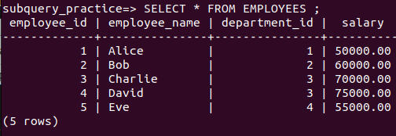
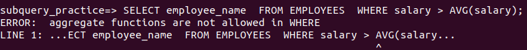
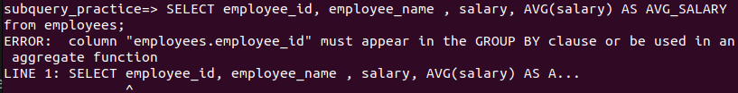
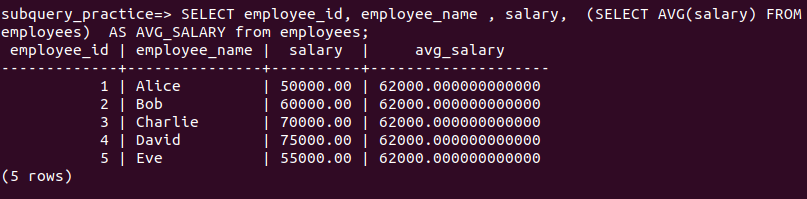

# Module 3: Intermediate SQL

## Refining your Results

### Using String Patterns and Ranges

String Patterns

LIKE: Use before, after or both before and aftr the pateern

Examples

```SQL
SELECT * FROM employees WHERE FNAME LIKE '%e'
```
```SQL
SELECT * FROM employees WHERE FNAME LIKE 'a%'
```
```SQL
SELECT * FROM employees WHERE FNAME LIKE '%z$'
```

BETWEEN: values in a range: the bornes are inclued

```SQL
SELECT * FROM employees WHERE AGE BETWEEN 40 AND 50
```

IN: Check if the values in a resuls is in a list of values

```SQL
SELECT * FROM employees WHERE COUNTRY IN ('BENIN','MOROCCO')
```


### Sorting Result Sets

ORDER BY col_name

ORDER BY col_num where col_num represents the column sequence number in the result set.

ORDER BY col_name_or_num ASC: Sort in ASC order. This is the default behaviour

ORDER BY col_name_or_num DESC: Sort in DESC order.

#### Examples


### Grouping Result Sets

#### DISTINCT

used to remove duplicates

Examples

```SQL
SELECT DISCTINCT(country) FROM employees - Some emplys may have the same contry
```

#### GROUP BY

Groups results

```SQL
SELECT country, fname FROM employees GROUP BY country
```

```SQL
SELECT country, count(country) FROM employees GROUP BY country
```

```SQL
SELECT country, count(country) AS count_value FROM employees GROUP BY country
```

#### HAVING

```SQL
SELECT country, count(country) AS count_value FROM employees GROUP BY country HAVING count(country) > 4
```

```SQL
SELECT country, count(country) AS count_value FROM employees GROUP BY country HAVING count_value > 4
```


## Built-in Database Functions

- Most DBS come with built-in functions
- These functions can be included in SQL statemens
- That reduce the amount of data retrieved by SQL queries
- It can speed up data processing

### Aggregate or Column Functions

They take a collection of values (an entire colum for example) and return a single value or null

#### Examples: SUM, MIN, MAX, AVG

- SUM: Add up all the values in a colum

```SQL
SELECT SUM (<column>) FROM (<table>)
```

To name the result:

```SQL
SELECT SUM (<column>) AS my_sum FROM (<table>)
```

- MIN: Get the minimum vaue in a column
- MIN: Get the maximum vaue in a column

```SQL
SELECT MAX (<column>) FROM (<table>)
```

A where clause can be added to queries containing aggrage functions

```SQL
SELECT MIN (<column1>) FROM (<table>) where (<condition>)
```

- AVG: The avarage value in a column

```SQL
SELECT AVG (<column>) FROM (<table>)
```

The input colum of aggregate functions can be the result of any mathmatical operation 0ne one or many columns of the table.

```SQL
SELECT AVG (<column1>+<column2>) FROM (<table>)
```

### Scalor and String Functions

- Scalors functions perform operation on each value in the specified colum. The result is a column.

#### Examples: ROUND

```SQL
SELECT ROUND (<column>) FROM (<table>)
```

The result of this query is a colum where each value is the round of the concerned value in the input column.

-  String Functions are scalor functions designed to operate on strings (CHAR and VARCHAR)


#### Examples: LENGTH, UCASE, LCASE

- LENGTH:

```SQL
SELECT LENGTH (<string_column>) FROM (<table>)
```

The result of this query is a colum where each value is the number of caracters of the concerned string value in the input column.

- UCASE and LCASE

```SQL
SELECT UCASE (<string_column>) FROM (<table>)
```

```SQL
SELECT LCASE (<string_column>) FROM (<table>)
```

Scalor functions can be used in where clause.

```SQL
SELECT <column> FROM (<table>) WHERE UCASE (<string_column>)='MY_VALUE'
```

```SQL
SELECT DISTINCT(LCASE (<string_column>)) FROM (<table>)
```

## Date and Time Built-in Functions

### Special data types for date and time in SQL

- DATE  YYYYMMDD (8 digits)
- TIME HHMMSS (6 digits)
- TIMESTAMP YYYYXXDDHHHHSSZZZZZZ (20 digits) where XX represents month and ZZZZZZ represents microseconds

### Datetime Functions

- YEAR
- MONTH
- DAY
- DAYOFMONTH
- DAYOFWEEK
- DAYOFYEAR
- WEEK
- HOUR
- MINUTE
- SECOND

### Examples


```SQL
SELECT DAY (<date_column>) FROM (<table>)
```

This operates on each date value of the date column and return it's day portion ie a value in [1-31]. The final result is a colum containing the day values.

Date and time functions can be used in where clause

```SQL
SELECT COUNT (*) FROM (<table>) WHERE MONTH(<date_column>)='05
```

Date or time arithmetic


```SQL
SELECT DATE_ADD (<date_column>,INTERVAL 3 DAY) FROM (<table>)
```

Return a new colum where each value is the date in concerned value in the input colum + 3 days.

Special registers

- CURRENT DATE
- CURRENT TIME

```SQL
SELECT FROM_DAYS (DATETDIFF(CURRENT_DATE,<date_column>)) FROM (<table>)
```

This returns a new colun where each value is the the number of days between the current date and the date in the concerned input column value.

## Sub-Queries and Nested Selects

A sub-query or sub-select is a query inside another. It is a query nested inside another query.

### Example: A sub-query in the where clause

```SQL
SELECT <column1> FROM (<table>) WHERE column2= (SELECT <column2> FROM (<table>)) 
```

Aggregate functions not allowed in where

Let ius consider this scenario

```SQL
-- Create the departments table
CREATE TABLE departments (
    department_id SERIAL PRIMARY KEY,
    department_name VARCHAR(50) NOT NULL
);

-- Insert initial data into the departments table
INSERT INTO departments (department_name)
VALUES
    ('Human Resources'),
    ('Finance'),
    ('Engineering'),
    ('Marketing');

-- Create the employees table
CREATE TABLE employees (
    employee_id SERIAL PRIMARY KEY,
    employee_name VARCHAR(50) NOT NULL,
    department_id INT REFERENCES departments(department_id),
    salary DECIMAL(10, 2) NOT NULL
);

-- Insert initial data into the employees table
INSERT INTO employees (employee_name, department_id, salary)
VALUES
    ('Alice', 1, 50000.00),
    ('Bob', 2, 60000.00),
    ('Charlie', 3, 70000.00),
    ('David', 3, 75000.00),
    ('Eve', 4, 55000.00);
```


Sub query in where 

Suppose we wanna have the name of employees that earn more than the average salary of all employees

Try

```SQL
SELECT employee_name FROM EMPLOYEES  WHERE salary > AVG(salary);
```

and youl get an error: ERROR:  aggregate functions are not allowed in WHERE
LINE 1: SELECT * FROM EMPLOYEES  WHERE salary > AVG(salary);



Aggregate functions are not allowed in where.

The solution: Use AGV as sub-query in where

Sub query in list of columns 

Suppose we wanna compare the salary of each employee with the avareage salay. Try the following and you will get an error.

```SQL
SELECT employee_id, employee_name , salary, AVG(salary) AS AVG_SALARY from employees;
```


Solution: use AGG in sub query

```SQL
SELECT employee_id, employee_name , salary, AVG(salary) AS AVG_SALARY from employees;
```




Sub query in from

```SQL
SELECT * FROM (SELECT employee_id, employee_name from employees) as result;
```

This is not useful in this case, but is powerfully used often when dealing with multiple tables.

## Querying Multiple Tables

Query that acess more than one table

Several ways:

1. Sub queries
2. Implicit JOIN
3. JOIN operators: INNER JOIN, OUTER JOIN, and so on

Acess multiple queries using sub queries

Get emplyees with department id in the departmeent table


```SQL
SELECT * from employees WHERE department_id in (SELECT department_id FROM departments);
```

Get employees with a specific location of departement

```SQL
SELECT * from employees WHERE department_id in  (SELECT department_id  FROM departments  WHERE location='Building A');
```

Get department id and department name for emplyees who earn more than 60000

```SQL
SELECT department_id, department_name  from departments WHERE department_id in ( SELECT department_id FROM employees WHERE salary> 60000);
```

- IMplicit Join: Specify 2 tables in the FROM cause

```SQL
SELECT * FROM employees, departments;
```

The result is a full join, also called cartesian join: Every row of the first table is joined with every row of the second table

The number of rows  in the resulting equal the product of the number of row of each input table

Limit the result set using additional operands

```SQL
SELECT * FROM employees, departments WHERE employees.department_id=departments.department_id;
```

Using alias

```SQL
SELECT * FROM employees as E, departments as D WHERE E.department_id=D.department_id;
```

or simply 

```SQL
SELECT * FROM employees E, departments D WHERE E.department_id=D.department_id;
```

To get the department name for each employee

```SQL
SELECT employee_name, department_name FROM employees E, departments D WHERE E.department_id = D.department_id ;
```

