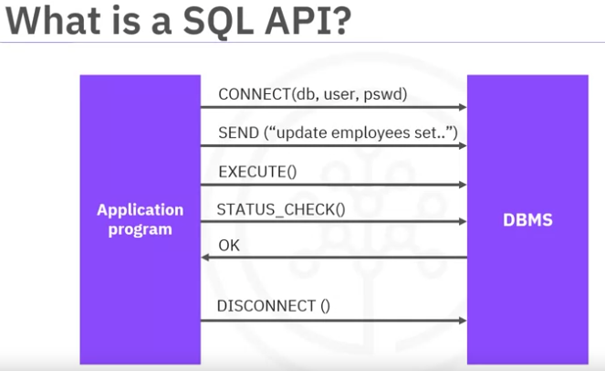
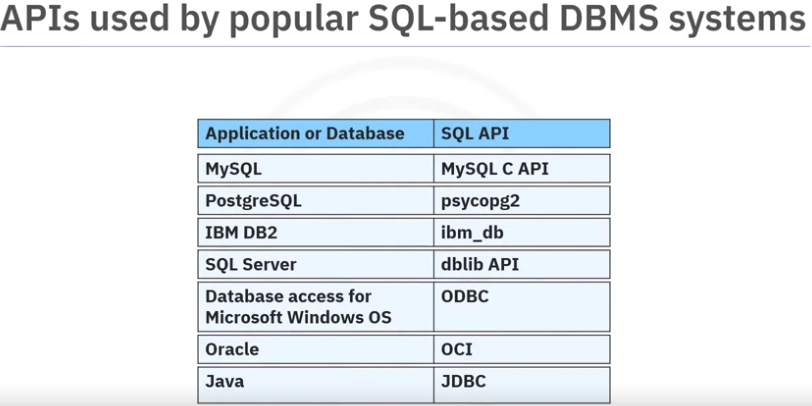
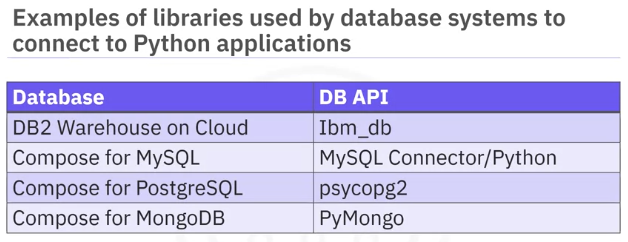
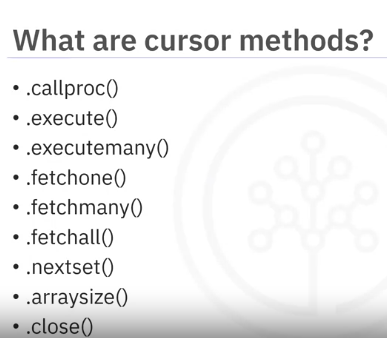
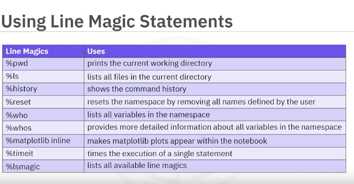

# Module 4: Acessing Databases using Python

## How to Access Databases Using Python

### Benefits

- Popularity
- Rich and easy to use ecosystem for data science: Numpy, Pandas, Matplotlib, Scipy
- Most DBS come with built-in functions
- TEasy to learn
- Portable 
- Supports Relational Database Systems
- Python Database API avalable (DB-API)
- Python Documentations available
- Notebooks use with Python

###  SQL API

An API is a set of functions that can be called for a specific service.

A SQL API is an API for a DBMS



### Examples of SQL APIs



## Writing codes using DB-API

### What is a DB-API
A DB-API 
- is a standard Python API for acessing DBMS.
- allows to write a programm that works with multiple kinds of relational databases instead of writing a seperate python code for each one. 

### Benefits

- Easy to implement and understand
- Similarity between python modules used to access databases
- Consistency implying easy understandable modules
- Portable accross databases: use the same code or programm with different db systems with minimal changes
- Broad reach of database connectivity from Python


### Examples of libraries
Each database system has it's own libraries.



### Main concepts of the Python DB API

When working with Python DB API, we
1. Open a connection object to get connected to the database
2. Run queries using cursor objects.

#### Connection Objects

Used to 
- connect to databases
- manage transactions

#### Cursor Objects

Used to 
- run queries
- scroll through result set
- retrieve results

The DB API includes a conncet constructor for creating a connection to the database. It returns a connection object which is then used by the various connction methods

### Connection methods

- cursor: Return a new cursor object using a connection
- commit: Used to commit any pending transaction to the database
- rollback: causes the database to rollback to the start of any pending transaction
- close: close a database connection

### Cursor methods

These objects represent a database cursor.



Cursor objects on the same db are not isolated: Any changes made using a cursor object is reflected via the others cursor objects.

### Writing code using DB-API

```python
# 1. Import the database module
from dbmodule import connect

# 2. Use the connection constructor to open a connection to the database and create a connection object

Connection= connect('databasename','username','passwd') # This returns a connection object

# 3. Create a cursor object on the connection object

Cursor=connection.cursor()

# 4. Run queries

Cursor.execute('sql query')
Results=cursor.fetchall()

# 3. Free resources

Cursor.close()
Connection.close()
```

## Accessing Databases with SQL Magic

### Magic Statements

Magic commands/functions are special commands that provides special features

### Types of Magic Statements

- Line Magics
- Cell Magics

#### Line Magics

- Operate on a single line
- Prefixed with a single %

##### Examples



#### Cell Magics

- Operate on multiple lines of input
- Prefixed with two %

### Using SQL Magic

- Install ipython-sql

```bash
!pip instal  --user ipython-sql
```
- Establish a connection to the database

- Enable the SQL magic in Jupyter notebook

```
%load_ext sql # or %%load_ext sql for cell magic
```

## Analyzing data with Python


